# Custom Modal React Component
React component which allows to display a customizable modal with different themes and parameters.

## Table of content

- [Installation](#installation)
- [Version](#version)
- [Technologies](#technologies)
- [Usage](#usage)
- [Props](#props)
- [Modal preview](#modal-preview)
- [Global settings](#global-settings)
- [Customization](#customization)
- [Themes](#themes)
- [Contribution](#contribution)
- [Author](#author)
- [Changelog](#changelog)
- [Licensing](#licensing)

## Installation

```bash
npm install custom-modal-react-component
```

## Version

This package is in version 1.0.1

## Technologies
- **JavaScript**
- **SASS**: 1.80.5
- **React**: 18.3.1
- **React DOM**: 18.3.1
- **Node**: 18.16.1

## Usage

```jsx
import React, { useRef } from "react"
import Modal from "custom-modal-react-component"
import "custom-modal-react-component/dist/styles/modal-component.css"
import closeIcon from "custom-modal-react-component/dist/icons/close.svg" /* You can change the closeIcon path if it is different */

function App() {
	const modalRef = useRef() 

	/* Call modalRef.current.open() when you want the modal to open, for example after a form submission.
	   Only "if(modalRef.current)" and its content are mandatory, you can adapt this example for your own needs.
	*/
	const handleSubmit = (e) => {
		e.preventDefault()
		if (modalRef.current) {
			modalRef.current.open()
		}
	}

	return (
		<>
			{/* Only the <Modal /> component with its required props is mandatory here, you can adapt this example for your own needs. */}
			<Modal ref={modalRef} icon={Your icon path} title="Your title" message="Your message" theme="light" closeIconPath={closeIcon} />
			<form onSubmit={handleSubmit}>
			<label htmlFor="Field">Field</label>
				<input type="text" />
				<button>Submit</button>
			</form>	
		</>
	)
}
```

## Props

<table>
	<thead>
		<th>Field name</th>
		<th>Type</th>
		<th>Required</th>
		<th>Description</th>
	</thead>
	<tbody>
		<tr>
			<td>ref</td>
			<td>String</td>
			<td>Yes</td>
			<td>Reference which allows to use the modal, same constant name for useRef()</td>
		</tr>
		<tr>
			<td>icon</td>
			<td>String (URL Path)</td>
			<td>No</td>
			<td>Icon next to the title</td>
		</tr>
		<tr>
			<td>title</td>
			<td>String</td>
			<td>No</td>
			<td>Modal title</td>
		</tr>
		<tr>
			<td>message</td>
			<td>String</td>
			<td>No</td>
			<td>Modal message</td>
		</tr>
		<tr>
			<td>theme</td>
			<td>String</td>
			<td>No</td>
			<td>Name of the theme (e.g., "light", "dark")</td>
		</tr>
		<tr>
			<td>closeIconPath</td>
			<td>String (URL Path)</td>
			<td>Yes</td>
			<td>Path for the close icon SVG</td>
		</tr>
	</tbody>	
</table>

## Modal preview

A background is added behind the modal, preventing to interact with the back of the page.

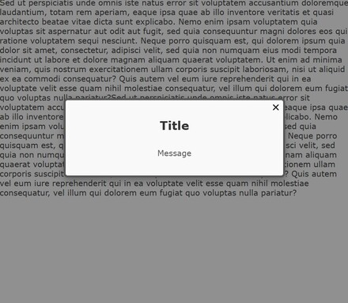


## Global settings

The modal is designed with a maximum height and width of 75% of its container. 

A scrollbar appears if the content exceeds the modal height.

## Customization

To apply default styles, import the component's CSS:

```jsx
import "custom-modal-react-component/dist/styles/modal-component.css"
```

Several preset themes are available, go to the [next section](#themes) to check.

### Available Classes for Custom Styling

- .modal : Style the modal container (e.g., background, border)
- .modal-title : Style the title text
- .modal-message : Style the message content


## Themes

Choose from multiple themes by setting the theme prop with one of the theme names below.

- [Light](#light-theme)
- [Dark](#dark-theme)
- [Minimal](#minimal-theme)
- [Mystic](#mystic-theme)
- [Candy](#candy-theme)
- [Organic](#organic-theme)
- [Coffee](#coffee-theme)
- [Tech](#tech-theme)
- [Urban](#urban-theme)
- [Success](#success-theme)
- [Warning](#warning-theme)
- [Information](#information-theme)

How to use it with the candy theme, for example :

```jsx
<Modal ref={modalRef} title="Your title" message="Your message" theme="candy" closeIconPath={closeIcon} />
```


### Light theme

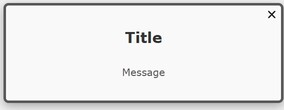

### Dark theme

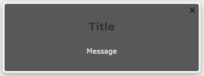

### Minimal theme

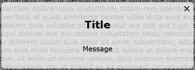

### Mystic theme

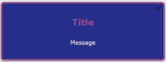

### Candy theme

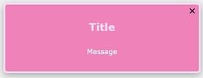

### Organic theme

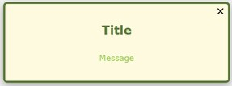

### Coffee theme

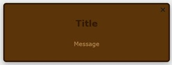

### Tech theme

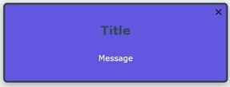

### Urban theme

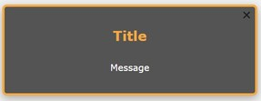

### Success theme


### Warning theme

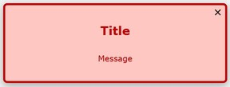

### Information theme

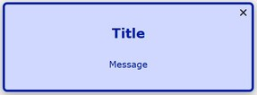


## Contribution

This project was conducted as part of a training course and is not open to external contributions at this time.

## Author

Mégane Navarro (navarromegane@gmail.com)

## Changelog

### [1.0.1] - 2024-11-15
- First stable version
- Adding a declaration file
- Documentation improvement

### [0.0.0] - 2024-11-10
- First Beta Version

## Licensing

This project was built under the ISC licence.